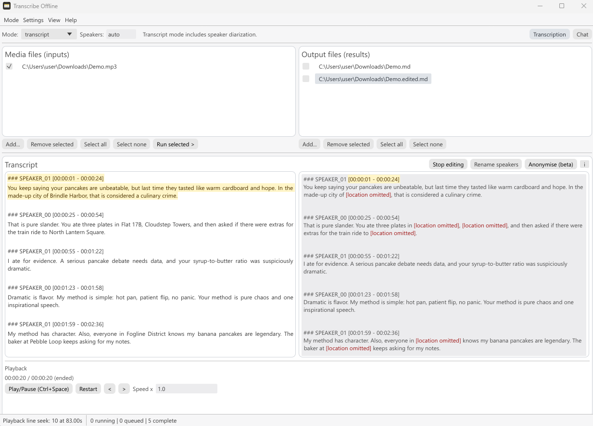

# Transcribe Offline

> [!WARNING]
> **Active development notice:** This branch is under active development and may change frequently. Speaker diarization currently supports conversations with up to 2 speakers only. For stable use, please use the [`Legacy` branch](https://github.com/openresearchtools/transcribeoffline/tree/Legacy).



**Transcribe Offline** is an open-source desktop app for local transcription,
speaker diarization, and transcript review/edit workflows.
It is implemented as a native Rust/egui GUI on top of
[`Openresearchtools-Engine`](https://github.com/openresearchtools/engine).

It focuses on:
- transcription workflows (`speech` / `subtitle` / `transcript`),
- speaker diarization,
- local transcript chat and anonymisation,
- and desktop-first editing/playback flows.

## What it does

### 1) Local transcription modes
Runs the engine audio path for:
- `speech` output,
- `subtitle` output,
- `transcript` output with speaker diarization.

### 2) Speaker diarization
Uses the engine's native C++ pyannote-style diarization integration and model packs. 

### 3) Transcript review and editing
Provides side-by-side transcript/edit views, playback-linked navigation, autosave,
speaker rename tools, and anonymisation pass tooling.

### 4) Local LLM helpers
Uses the engine bridge chat path with local GGUF models for transcript Q&A and
anonymisation extraction.
For chat/anonymisation, you can use any `llama.cpp`-compatible GGUF model;
instruction-following chat models are recommended.

Anonymisation is a **beta** function. For real-world use, always manually review
the output transcript to confirm no unintended sensitive data remains.

> Designed to be local‑first. However, no software can guarantee absolute privacy or security. Please consider your threat model and institutional policies before processing sensitive material.

## Unsigned Build Notice

This app is an open-source hobby development effort by the repository owner.
We do not currently have funding for full paid code-signing and notarization
pipelines across all platforms/releases.

Because of that, operating-system protections or hardened security environments
(for example Windows SmartScreen, enterprise endpoint controls, or macOS
Gatekeeper policies) may block unsigned binaries.

If your environment blocks unsigned binaries, the recommended path is:
- build this desktop app from source on the target device,
- build Openresearchtools-Engine from source on the same target device,
- and use those locally-built artifacts in your deployment.

### Windows (when blocked)

- If SmartScreen shows "Windows protected your PC", use `More info` ->
  `Run anyway` only if your policy allows it.
- In the app, go to `Settings -> Runtime Setup` and run:
  - `Download/Repair runtime`
  - `Unblock unsigned runtime`
  - `Recheck`
- The Windows unblock script clears Mark-of-the-Web flags in the selected
  runtime directory by running `Unblock-File` recursively on runtime files.

### macOS (when blocked)

- Try `Right click -> Open` on first launch.
- If blocked by Gatekeeper, use `System Settings -> Privacy & Security ->
  Open Anyway` when available and policy permits.
- In the app, after runtime install/repair, click `Unblock unsigned runtime`
  then `Recheck`.
- The macOS unblock script removes quarantine attributes recursively
  (`xattr -dr com.apple.quarantine`) and restores executable bits for runtime
  binaries/scripts where needed (`chmod +x` on relevant files).

---

## Highlights

- Offline-first runtime flow with in-app runtime install/repair.
- Native desktop orchestration of Openresearchtools-Engine (`llama-server-bridge`).
- Single device selection model (CPU or selected GPU) for runtime execution.
- Built-in transcript editing, playback follow, anonymisation, and export workflow.


---

## How it works (in this repo)

- This app is a GUI/orchestration layer.
- Openresearchtools-Engine provides the local runtime components.
- The app invokes runtime features through `llama-server-bridge`.
- Playback decode in the app uses the Rust `Symphonia` stack; runtime-side media conversion uses engine FFmpeg components.

## Project relationship

- `Transcribe Offline` is a reference example of integrating Openresearchtools-Engine in a native desktop GUI.
- This app uses `llama-server-bridge` from Openresearchtools-Engine.
- Openresearchtools-Engine runs on a modified `llama.cpp` runtime path to support a native C++ pyannote-style diarization pipeline.
- This desktop app itself is a wrapper/orchestrator around that runtime.
- This desktop app relies on Openresearchtools-Engine runtime media components (FFmpeg/PDFium) at runtime.

## Acknowledgements (used in this app/runtime path)

- [`Openresearchtools-Engine`](https://github.com/openresearchtools/engine):
  embeddable runtime used by this app (`llama-server-bridge`, runtime orchestration, and model/device execution path).
- [`egui`](https://github.com/emilk/egui) / [`eframe`](https://github.com/emilk/egui/tree/master/crates/eframe):
  native immediate-mode GUI framework used to build this desktop application UI.
- [`llama.cpp`](https://github.com/ggml-org/llama.cpp) and [`ggml`](https://github.com/ggml-org/ggml):
  core inference runtime and device/offload mechanics used through Openresearchtools-Engine.
- [`whisper.cpp`](https://github.com/ggml-org/whisper.cpp):
  transcription backbone used by the engine audio pipeline.
- [`pyannote.audio`](https://github.com/pyannote/pyannote-audio) and [`WeSpeaker`](https://github.com/wenet-e2e/wespeaker):
  diarization lineage and model/pipeline provenance used by the engine's native C++ diarization path.
- [`FFmpeg`](https://github.com/FFmpeg/FFmpeg) (LGPL shared runtime builds):
  media decoding/normalization path used by Openresearchtools-Engine runtime for audio conversion.
- [`Symphonia`](https://github.com/pdeljanov/Symphonia):
  Rust audio decoding stack used by this desktop app for local playback.

## Model acknowledgements (upstream model repos)

- [`openresearchtools/whisper-large-v3-turbo-GGML`](https://huggingface.co/openresearchtools/whisper-large-v3-turbo-GGML)
  and [`openresearchtools/whisper-large-v3-GGML`](https://huggingface.co/openresearchtools/whisper-large-v3-GGML):
  converted Whisper runtime artifacts used by the app's managed transcription downloads.
- [`openai/whisper-large-v3-turbo`](https://huggingface.co/openai/whisper-large-v3-turbo)
  and [`openai/whisper-large-v3`](https://huggingface.co/openai/whisper-large-v3):
  upstream Whisper model family references for the managed transcription downloads.
- [`openresearchtools/speaker-diarization-community-1-GGUF`](https://huggingface.co/openresearchtools/speaker-diarization-community-1-GGUF):
  diarization model-pack repository used by the engine diarization path in this app.
- [`pyannote/speaker-diarization-community-1`](https://huggingface.co/pyannote/speaker-diarization-community-1):
  upstream diarization pipeline lineage referenced by the OpenResearchTools conversion path.

## Non-endorsement statement

This project is independent work by OpenResearchTools.
This project is **not affiliated with, sponsored by, or endorsed by** the maintainers/owners of any third-party projects listed above or in the bundled notices/license files.

All third-party names and marks remain property of their respective owners.


## Licensing and notices

The Transcribe Offline application source code is licensed under the MIT License; third-party dependencies and bundled components remain licensed under their respective original licenses.

Read these files in this repo:

- Notice page (app + models + engine): `licenses/THIRD_PARTY_NOTICES_ALL.md`
- Full app third-party licenses (full text per package): `licenses/APP_THIRD_PARTY_LICENSES_FULL.md`
- Full engine third-party licenses (full text per package/file): `licenses/ENGINE_THIRD_PARTY_LICENSES_FULL.md`
- `Help -> Notices`
- `Help -> App licenses`
- `Help -> Engine licenses`


## Models and conversions

- Whisper model binaries are fetched from
  `openresearchtools/whisper-large-v3-turbo-GGML` and
  `openresearchtools/whisper-large-v3-GGML`.
- Diarization model pack is fetched from
  `openresearchtools/speaker-diarization-community-1-GGUF`.
- OpenResearchTools publishes converted model artifacts for runtime compatibility.

Converted-model note:
- These converted artifacts are provided for interoperability with this runtime.
- They are not upstream-official releases and are not endorsed by upstream model owners.
- Use follows the original model licenses and model-card terms.

For citations and model lineage references, see the bundled Notices document:
- `licenses/THIRD_PARTY_NOTICES_ALL.md`

## How to cite

Suggested citation:

Rutkauskas, L. (2026). *Transcribe Offline* (Version 2.0.0) [Computer software].
OpenResearchTools. <https://github.com/openresearchtools/transcribeoffline>.

BibTeX:

```bibtex
@software{Rutkauskas_TranscribeOffline_2026,
  author    = {Rutkauskas, L.},
  title     = {Transcribe Offline},
  version   = {2.0.0},
  date      = {2026-03-04},
  url       = {https://github.com/openresearchtools/transcribeoffline},
  publisher = {OpenResearchTools},
  license   = {MIT}
}
```
